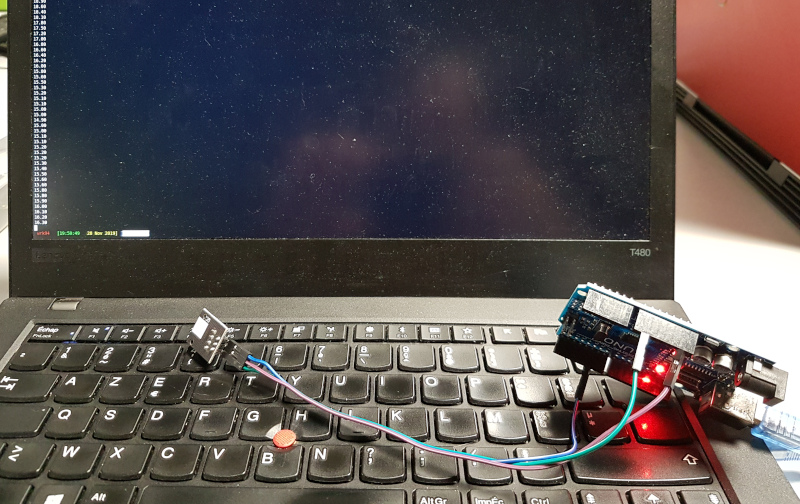

# Introduction

Ce tutoriel a été suivi lors de la session Arduino du 28 novembre.

Les capteurs DHT permettent selon les spécifications de prendre au moins une
mesure toutes les 2 secondes environ. Nous avons utilisé la bibliothèque DHT
(qui nécessite Adafruit Sensor).

A noter que contrairement à ce que l'on imaginait au départ, la lecture du
capteur se fait via une entrée numérique (et non analogique).

Le capteur, branché sur l'entrée 5, boucle toutes les deux secondes et envoie
sur la console série les relevés.

# Code

Nous avons créé une branche dans le [dépot github dédié à nos
expérimentations](https://github.com/fablab-leprototype/arduino-sandbox/tree/dht11).

