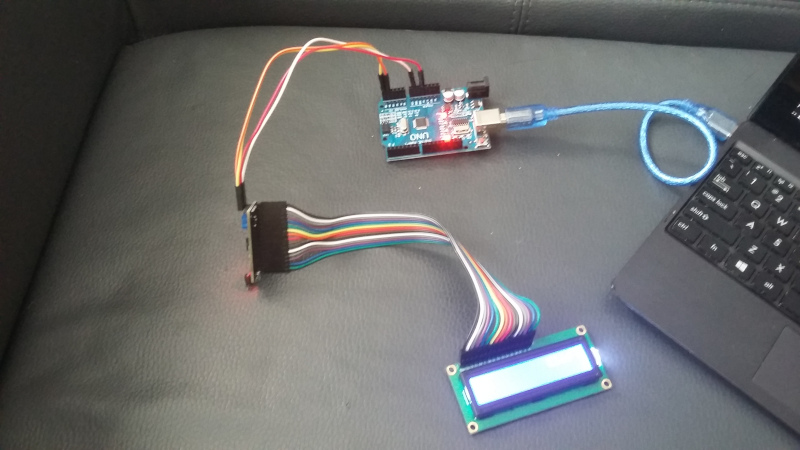
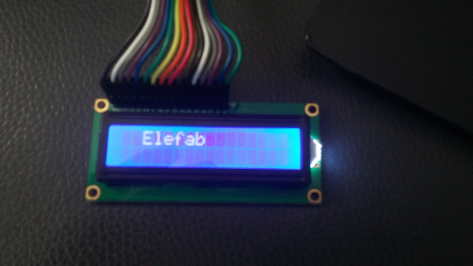

# Introduction

Il est courant dans les kits arduino de proposer un écran LCD. Celui que j'ai
dans mon kit est un `Liquid Crystal 1602a`.

Mon kit fournissant en outre un contrôleur pour l'écran, nous avons donc deux
solutions:

* Soit on cable directement l'écran sur l'arduino,
* Soit on passe par le contrôleur I2C fourni

La deuxième solution permet d'avoir moins de cables à brancher sur l'arduino,
ce qui peut permettre de privilégier d'autres périphériques sur les entrées
sorties.

# Méthode 1: LCD sans contrôleur I2C

Cf [Ce tutoriel](http://www.dreamdealer.nl/tutorials/connecting_a_1602a_lcd_display_and_a_light_sensor_to_arduino_uno.html).

Note: Le [site officiel
Arduino](https://www.arduino.cc/en/Reference/LiquidCrystal) propose aussi un
ensemble de tutoriels.

# Méthode 2: LCD avec contrôleur I2C

## Câblage

Notre écran LCD peut être utilisé avec un contrôleur de bus I2C. L'avantage
est que le nombre de sorties utilisées sur l'Arduino est réduit par rapport à
la méthode précédente. En effet, 4 cables seront nécessaires pour câbler
l'arduino au contrôleur:

* `GND` sur `GND`,
* `VCC` sur une sortie 5V de l'arduino,
* `SDA` du contrôleur sur `A4`,
* `SCL` du contrôleur sur `A5`

`SDA` et `SCL` sont des pins classiques des contrôleurs de bus I2C, les curieux
trouveront plus d'informations sur
[Wikipedia](https://fr.wikipedia.org/wiki/I2C#Topologie).

Ci-dessous, une vue d'ensemble de notre montage:

## Code

L'inspiration de ce tutoriel provient du site
[Sunfounder](https://www.sunfounder.com/learn/Sensor-Kit-v2-0-for-Arduino/lesson-1-display-by-i2c-lcd1602-sensor-kit-v2-0-for-arduino.html).
Le code source de notre programme se trouve sur le [dépot git arduino-sandbox du fablab](https://github.com/fablab-leprototype/arduino-sandbox/tree/lcd-1602a-i2c),
branche `lcd-1602a-i2c`.

Ce code est compilable en dehors de l'environnement de développement Arduino, mais nécessite toutefois
l'utilisation du SDK Arduino (Paquet debian `arduino-core`).

Par ailleurs, il nécessite une bibliothèque tierce disponible [sur
github](https://github.com/marcoschwartz/LiquidCrystal_I2C/), et dont les
sources ont été incluses dans la branche de notre dépot, au sein du
sous-répertoire
[liquidcrystal](https://github.com/fablab-leprototype/arduino-sandbox/tree/lcd-1602a-i2c/liquidcrystal).

Intéressons-nous au fichier `lcd.c` ; celui-ci reprend quelques éléments des
tutoriels précédents, avec quelques nouveautés:

* Ligne 9: En réalité, malgré l'extension de fichier `.c`, nous compilons notre
  programme en C++, via le compilateur `avr-g++`. L'environnement de
  développement arduino cache certaines choses à l'utilisateur lors du processus
  de compilation, et nous devons définir une fonction C supplémentaire pour
  résoudre les fonctions "C++ pures virtuelles" qui n'auraient pas été définies
  dans le code lors du processus d'édition des liens (link). Sans cette ligne, le
  programme ne pourra être compilé.

* Ligne 20:  L'initialisation de la bibliothèque externe nécessite le passage
  en premier argument d'une addresse pour pouvoir envoyer au contrôleur les
  différentes commandes. Dans le code récupéré avant adaptation ici, cette
  addresse était `0x27`, mais l'addresse correcte pour piloter mon contrôleur
  était au final `0x3f`.

* ligne 17: Changer la valeur de la variable `tim` permet de mettre à jour
  l'afficheur LCD plus ou moins vite.

## Résultat

Une fois le code envoyé sur l'arduino, via la commande `make`, nous obtenons le
résultat attendu:

