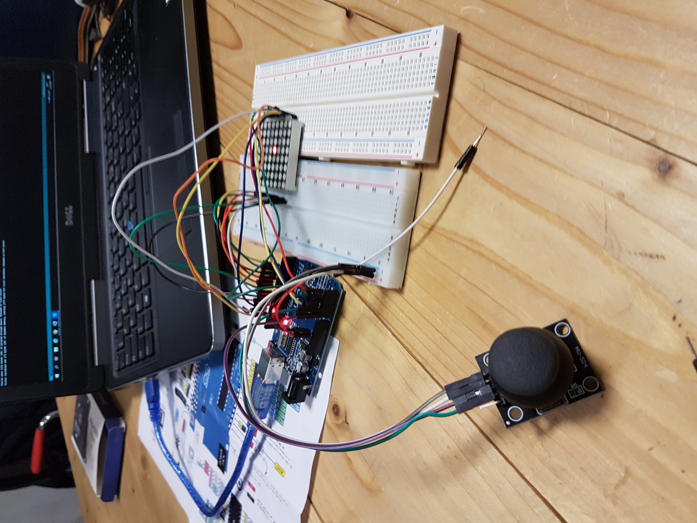

# Introduction

Ce tutoriel a été suivi lors de la première session Arduino du 10 octobre 2019
au Local.

Le but était de prendre en main la matrice de LED 8x8 fournie avec le kit
arduino que nous utilisons lors de ces séances de découverte.

Nous avons simplement suivi le tutoriel disponible sur le [site officiel
Arduino](https://www.arduino.cc/en/Tutorial/RowColumnScanning){:.text-danger}.

# Code

Afin de pouvoir compiler le code en dehors de l'environnement de développement
Arduino, nous avons créé une branche dans le [dépot github dédié à nos
expérimentations](https://github.com/fablab-leprototype/arduino-sandbox/tree/led-8x8){:.text-danger}.

# Pour aller plus loin

Nous avons terminé la séance sur le remplacement des 2 potentiomètres par un Joystick:

