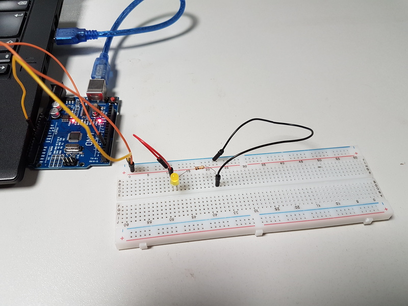

# Introduction

L'idée était dans l'optique d'éclairer le chateau réalisé à l'aide de la
découpe laser dans la vitrine, d'effectuer un allumage / extinction progressif
d'une LED. Je pensais au départ utiliser une sortie analogique et de faire
varier la tension de sortie. Mais je me suis rendu compte qu'utiliser une des
sorties numériques à signal carré (PWM) et faire varier la fréquence du signal
suffirait, notre persistence rétinienne ne suffisant pas à percevoir les
moments où la LED n'est plus alimentée.

# Réalisation

Le code est assez simple, une branche est disponible dans le [dépot github dédié à nos
expérimentations](https://github.com/fablab-leprototype/arduino-sandbox/tree/led-fade).

La fonction analogWrite() prend en paramêtre le numéro du pin, et une valeur
comprise entre 0 et 255.

Nous avions pourtant comencé à utiliser la sortie 2 de l'arduino Uno, or
celle-ci n'est pas de type PWM (signal carré). Donc nous ne voyons pas l'effet
d'atténuation, et la LED apparaissait soit allumée soit éteinte.

En sélectionnant une sortie plus appropriée (la 3 ou la 9 par exemple), nous
avons pu obtenir l'effet recherché.

