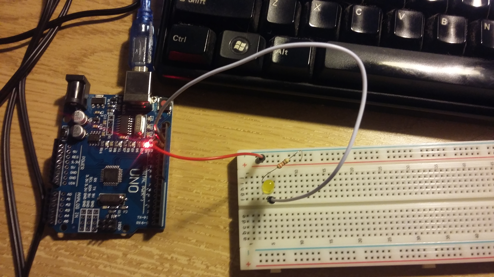

# Introduction

Vous venez de recevoir votre kit Arduino, celui-ci comporte tout un ensemble de
périphériques dont vous ne savez pas trop quoi faire avec encore, alors autant
commencer par simple: saisissez-vous d'une LED et d'une résistance, ainsi que
de deux cables pour raccorder l'arduino à la plaque d'essai.

# Matériel nécessaire

* 2 fils
* 1 résistance
* 1 LED

# Logiciel nécessaire

Le dépot github suivant: https://github.com/fablab-elefab/arduino-sandbox
sur la branche `led`.

comme vous pouvez le voir dans le fichier `led.c`, le code est relativement
simple et ne nécessite pas encore de compiler des briques de la bibliothèque
officielle Arduino.

La constante `BLINK_DELAY_MS` positionnée à 1000 indique que le clignotement
sera de 1 seconde.

# Montage

* l'arrivée de courant sur le pin 13, cf source
* Protection de la LED avec la résistance
* Retour en sortie de la LED vers GND de la carte arduino


# Compilation et envoi

Le `Makefile` fourni permet de:

1. Compiler le code
2. Créer un exécutable pour le microprocesseur de l'Arduino
3. Extraire juste la partie de code "effective" du binaire au format 'ihex'
4. Envoyer cette partie de code via le logiciel `avrdude`

`avrdude` accepte d'envoyer notre code compilé dans un format spécifique nommé
"intel hex" (ihex).

Un simple:

```
$ make
```

effectue donc les opérations décrites précédemment, et devrait permettre
d'obtenir le résultat recherché: Un clignottement de notre LED toutes les
secondes.

# Résultat



# Pour aller plus loin

* Vous pouvez changer le délai dans le code et recompiler / re-télécharger
* Remplacez la sortie 13 par le `POWER 3.3V` de l'autre coté de l'Arduino pour
  avoir une LED allumée continuellement
* Branchez ensuite un bouton poussoir de votre kit pour controller l'allumage
  et l'extinction de la LED

