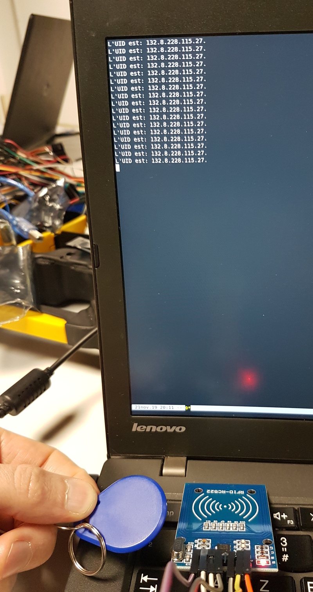

# Introduction

Ce tutoriel a été suivi lors de la session Arduino du 21 novembre.

Nous avions pour objectif d'utiliser basiquement un lecteur de carte NFC RC522
avec un arduino Uno.

Nous avons repris le code disponible sur le [site
idehack](http://idehack.com/blog/utiliser-un-module-rfid-rc522-avec-larduino/),
après un premier essai infructueux avec la bibliothèque arduino officielle.

# Code

Nous avons créé une branche dans le [dépot github dédié à nos
expérimentations](https://github.com/fablab-leprototype/arduino-sandbox/tree/rfid-rc522).

# Pour aller plus loin

Il faudrait comprendre pourquoi notre premier essai avec la bibliothèque
officielle disponible dans Arduino IDE ne fonctionnait pas. Nous avons
peut-être un soucis de configuration de la vitesse lors de la récupération des
traces via l'interface série USB.

Nous avons toutefois pu découvrir qu'un moyen d'avoir des retours de ses essais
sur Arduino était simplement d'utiliser un terminal ouvert sur l'interface USB et
d'utiliser la méthode `Serial.println()`.

