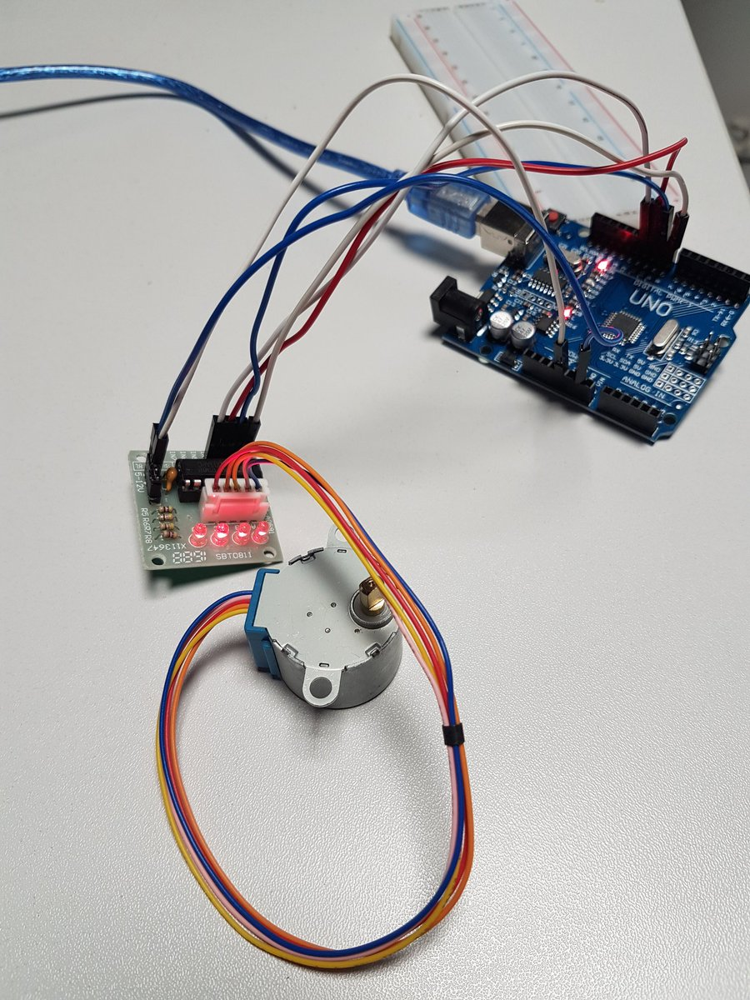

# Introduction

Le périphérique Arduino étudié lors de cette séance (le 30 janvier 2020) était
un moteur pas à pas fourni avec notre kit.

* La référence du moteur est la suivante: 28BYJ-48
* Ce dernier est piloté par une carte SBT0811, comprenant un composant ULN2003.

Nous nous sommes inspiré d'un [tutoriel sur le site
makerguides](https://www.makerguides.com/28byj-48-stepper-motor-arduino-tutorial/).

# Réalisation

Le SDK Arduino intégre une bibliothèque C++ pour commander le moteur
facilement. Nous avions dans un premier temps utilisé un autre code qui
effectuait une série de `digitalWrite()` afin de produire le même résultat, en
écrivant toutefois bien plus de code.

# Code

Une branche est disponible sur le [dépot
github](https://github.com/fablab-leprototype/arduino-sandbox/tree/stepper-motor)
dédié à nos expérimentations.

