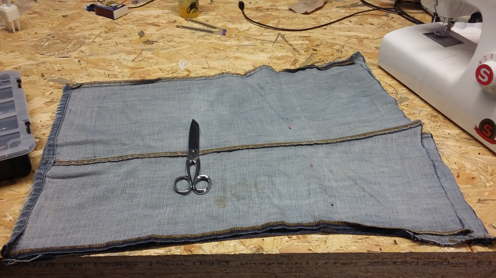
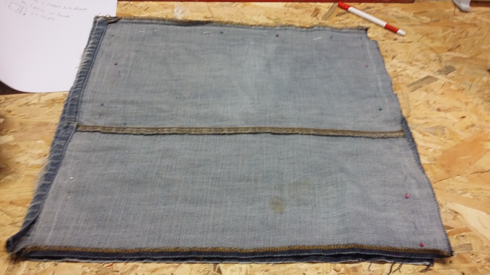
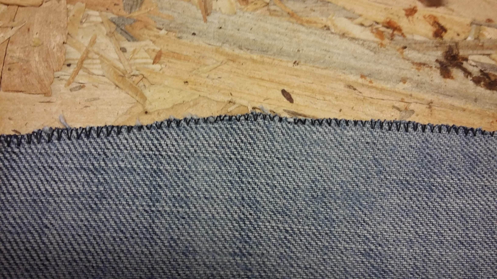
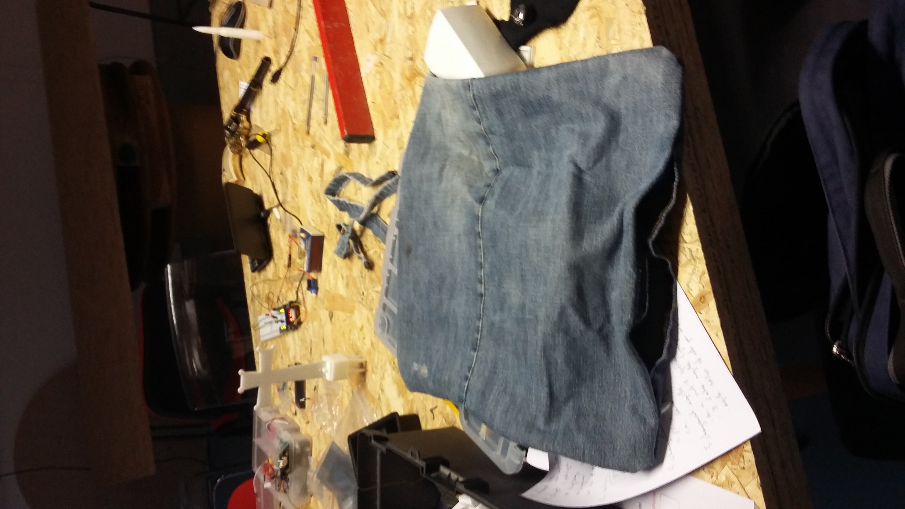
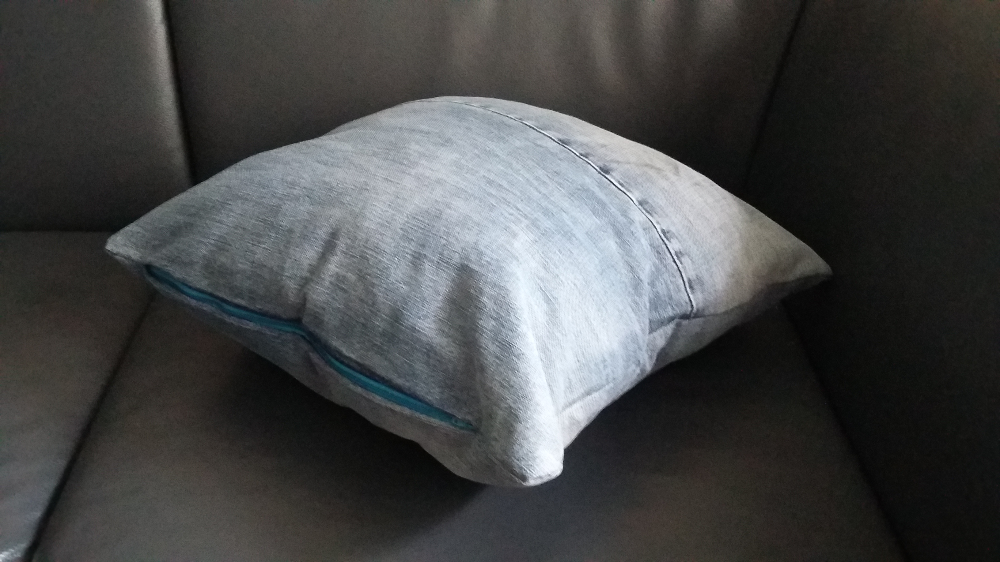

# Introduction

Dans le but de faire une rapide prise en main des machines à coudre, nous avons
pris un cas pratique: Ayant récupéré d'un vieux Jean un peu de tissu ainsi
qu'un oreiller, nous souhaitons réaliser un coussin.

Nous récupérons donc deux morceaux de tissus sur les deux jambes du Jean, comme
sur la vue d'ensemble ci-dessus.

# Découpe du tissu

Nous récupérons sur les jambes du Jean 2 bandes que nous allons assembler.

Nous posons les deux pièces de tissu l'une sur l'autre et nous les fixons
ensemble avec des épingles.

Une fois nos deux morceaux fixés, nous découpons grossièrement aux ciseaux la
partie superflue.

# Surjetage

Effectuer un surjetage a pour but d'éviter que le tissu ne s'effiloche sur
notre découpe précédente. On le réalise avec un motif zigzag sur la découpe, un
point dans le vide et un point dans le tissu.

* Sélection du zigzag le plus grand
* longueur de point sur 1 à 2
* tension du fil autour de 2

# Couture des deux pièces

Nous avons privilégié les réglages suivants:

* Couture droite,
* 1.5 de longueur (comme précédemment)
* Tension du fil entre 4 et 5 (tension standard)

# Difficultés

Nous avons rencontré assez souvent des problèmes de fil qui casse ; nous avons
tenté pour éviter cela de:

* Baisser la tension du fil
* Changer de fil pour un plus résistant (fil supérieur)
* Changer le fil de la canette (fil inferieur)

Nous avons alors changé d'aiguille pour en mettre une spéciale Jean. À noter
qu'il existe différents types d'aiguilles, selon le type de tissu utilisé:
Jersey - tissu plutot elastique -, Jean, ou même cuir. Les aiguilles par
défaut relativement polyvalentes sont les 90/14.

# Résolution

Nous sommes passés de la Singer à la Bluesky, sur laquelle nous
avons pu finir nos coutures.

Entre temps, nous avons effectué à nouveau divers essais sur la Singer sans
rencontrer de problèmes. Il manque peut-être une opération de maintenance qui
nous dépasse sur la Singer afin de la régler correctement et éviter ces
ruptures du fil.

Au final, notre projet une fois retourné dans le bon sens afin de masquer les
travaux de couture, ressemble à l'illustration suivante:

# Fermeture de la housse

Nous allons poser une fermeture éclair afin de pouvoir fermer la housse. Après
avoir raccourci la fermeture qui était d'origine trop longue, nous retournons
la housse, et nous fixons la fermeture d'un coté avec des aiguilles.

Nous cousons ensuite la fermeture sur une des extrémités de la housse.

Pour la deuxième extrémité, nous ouvrons la fermeture afin de pouvoir
travailler sans être géné, puis nous effectuons quelques finitions de chaque
coté en prenant une vitesse suffisemment lente pour travailler.

La précision nécessaire due à l'épaisseur réduite entre les dents en métal de
la fermeture et la pose de nos aiguilles nous oblige d'une part à une couture
droite et d'autre part à utiliser une vitesse relativement lente.

Une fois la fermeture posée, nous pouvons retourner la housse et y insérer
notre oreiller de récupération.

Avec un euro de dépense pour la fermeture éclair, un vieux Jean et un oreiller
récupéré, il est possible de fabriquer des coussins somme toute sympathiques et
amusants. Et l'utilisation d'une machine à coudre dans les grandes lignes n'a
probablement plus de secret pour vous.

