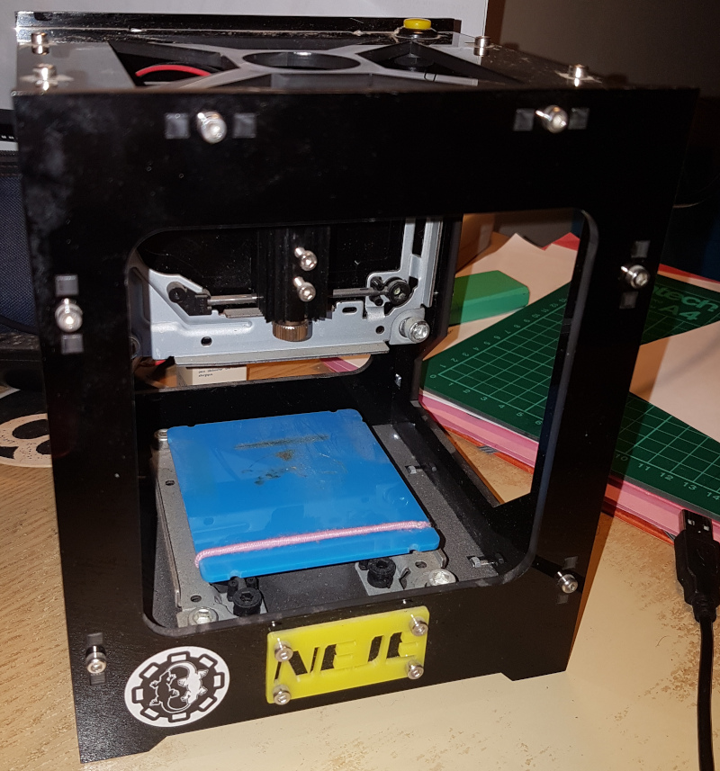
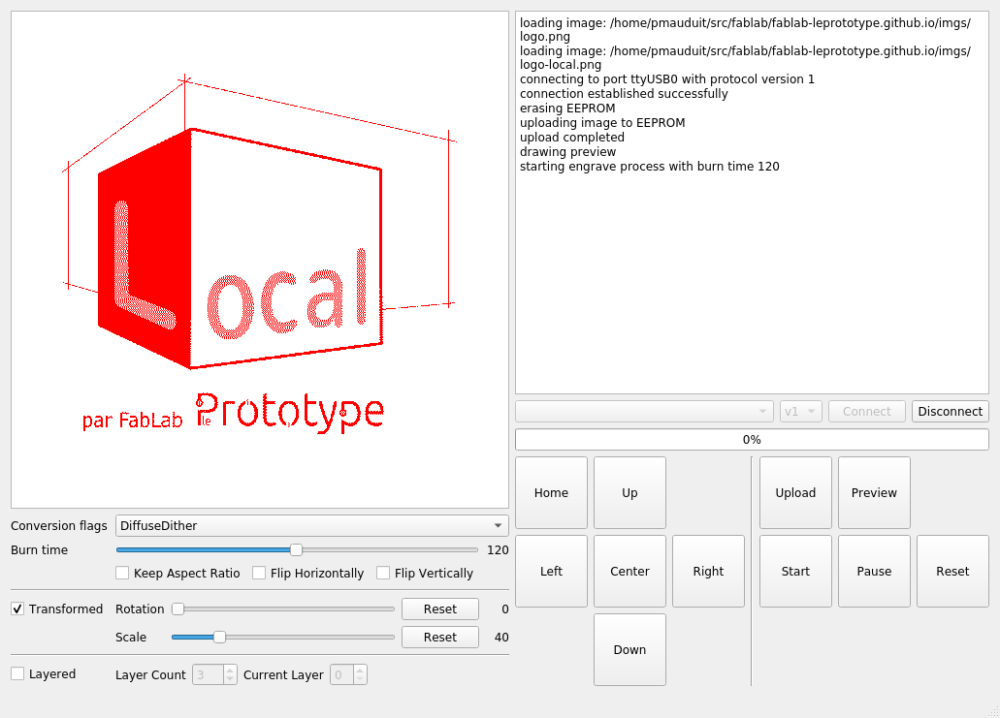
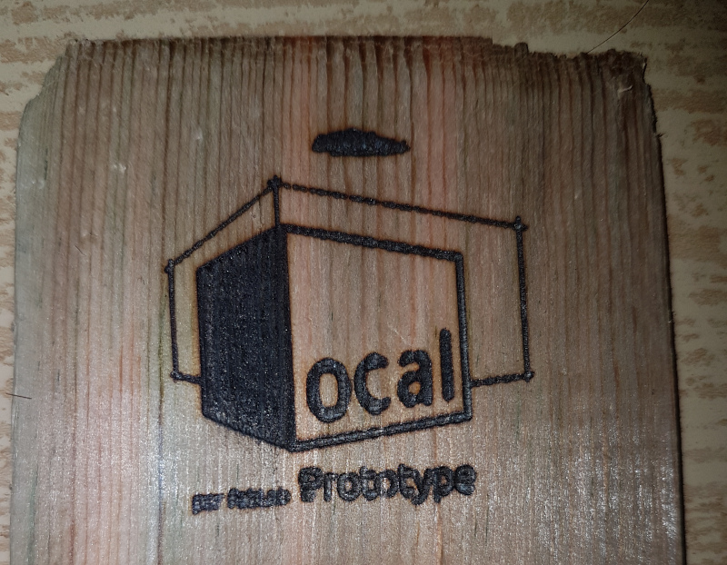

# Introduction

Cette machine a été concue pour des petits travaux de gravure à la laser. La
société produisant ces machines proposent des logiciels propriétaires pour
l'utiliser et aucune solution n'est proposée pour les utilisateurs de Linux.
Il existe toutefois une solution libre dont les [sources sont
disponibles sur Github](https://github.com/camrein/EzGraver).
Pour les utilistauers Mac OS X il existe une application Open Source : https://github.com/AndyQ/NejeLaserEngraver

Etant actuellement sous système Linux, nous allons donc utiliser EzGraver.

# Compilation

Simplement cloner le dépot précédent et suivre les instructions définies dans le README.

Il suffit ensuite - une fois la commande `make install` effectuée - d'aller dans le
sous-répertoire `EzGraverUi` et de lancer l'application.

# Présentation de la machine

Il s'agit d'un cadre en plastique carré avec un plateau se déplaçant d'avant
en arrière, le laser étant situé sur une partie mobile bougeant de gauche à
droite. Il n'y a pas d'axe Z. Présentation détaillé ici : http://www.tdms.fr/diy/DK-8/

2 entrées USB sont nécessaires au fonctionnement, sur la droite de la machine :

* 1 première entrée USB rectangulaire mâle, servant à l'alimentation électrique
  des moteurs.

* 1 entrée USB de type mini-usb, reliée à l'ordinateur, offrant une interface
  série et permettant le pilotage par le logiciel.

# Interface utilisateur de EzGraver

Cf capture ci-après:

Un click sur la zone de gauche permet de charger une image, nous pouvons
ensuite configurer l'algorithme de gravure parmi 3, ainsi que le temps de
brûlure du laser, et diverses options de taille et de mirroir sur l'image
chargée.

Note : il est possible d'effectuer plusieurs couches, mais cela nécessite de
procéder couche par couche et de renvoyer l'image à chaque fois dans le
firmware de la machine via le bouton "upload" (i.e. il faudra sélectionner la
première couche sur "current layer", clicker sur upload, puis la deuxième, et
ainsi de suite).

Une fois nos réglages effectués, il est possible de lancer la gravure, en :

1. Se connectant sur la machine (sélection de l'interface série, protocole v1,
   puis bouton "connect").
2. Clicker sur "upload".
3. Clicker sur "start".

# Conclusions

Ci-après le résultat de la gravure obtenue d'après les réglages présents sur la
capture d'écran précédente :

La surface de travail est très réduite (à peine quelques centimêtres). Aussi,
pour des travaux plus importants, il vous sera sans doute nécessaire d'utiliser
la [découpe laser](/decoupe-laser) du fablab.
